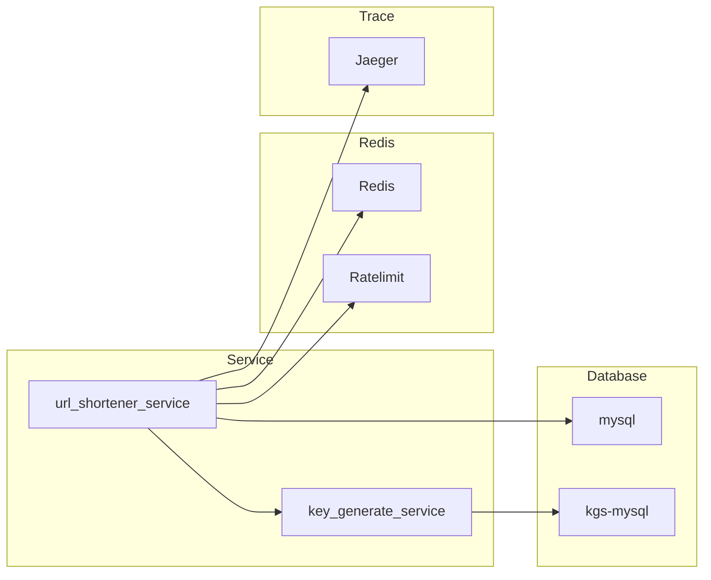
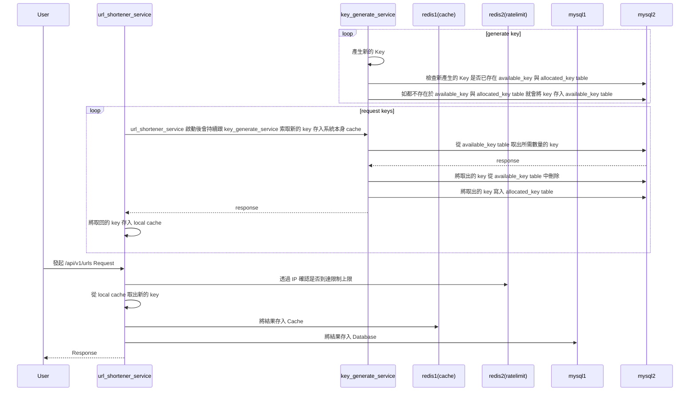
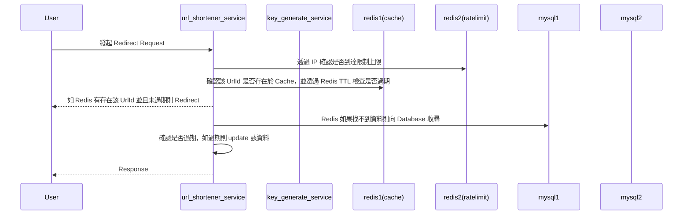

## 系統架構圖


### 說明
URL_Shortener 主要使用 mysql 當作資料庫並使用 Redis 當作暫存的 cache ，在 Service 的部分可以拆成兩個部分，一個是專門負責產生 UrlId 的 key_generate_service 與負責進行縮短網址和 redirect的 url_shortener_service。

這兩個 service 皆有相對應的 database 由於 key_generate_service 會不停地將新的 key 塞入 database ，經過觀察有發現隨著時間的推移 database 的效能會開始下降，所以主要是希望可以透過區分 database 的方式降低 database 的影響。

第一個 Redis 會當作 url_shortener_service 的 cache 來降低 Datbase 的負擔，第二個 Redis 主要是用來實現簡易的 Ratelimit。


hash採用 murmurhash 主要是考量到在 url_shortener 的部分並不會有加密上的考量，所以主要以效能優先在考量效能的情況下 survey 的結果 murmurhash 會是比較好的選擇。

在壓測的時候有透過 trace 觀察到整個 api 時間主要會有一半以上會消耗在存入的時候，如果使用情境可以接受先將結果存入 redis 再利用非同步的方式將資料存入 mysql 應該會提升不少 api 反應時間但這樣做會有掉資料的風險存在，認為這部分還是要看使用情境來決定所以並沒有實作。

---

## 產生新的短網址時序圖


---
## 短網址 Redirect 時序圖



---

在啟動的部分可分為以下幾種：

* 單獨啟動 url_shortener_service，且不啟動 Redis 當作暫存並且透過 url_shortener_service 本身產生 UrlId。
   * 啟動方式：於根目錄下執行
      ```
         make url_shortener
      ```
* 單獨啟動 url_shortener_service 並同時啟動 Redis 當暫存同樣透過 url_shortener_service 本身產生 UrlId。
   * 啟動方式：於根目錄下執行
      ```
         make url_shortener_reids
      ```
* 同時啟動 url_shortener_service 與 key_generate_service 透過 key_generate_service 獲取 UrlId。
   * 啟動方式：於根目錄下執行
      ```
         make url_shortener_kgs
      ```
* 同時啟動 url_shortener_service 與 key_generate_service 透過 key_generate_service 獲取 UrlId，並同時啟動 Redis 當暫存。
   * 啟動方式：於根目錄下執行
      ```
         make url_shortener_redis_kgs
      ```
* 啟動 Ratelimit、url_shortener_service 、 key_generate_service 透過 key_generate_service 獲取 UrlId，並同時啟動 Redis 當暫存。

Ratelimit 目前設定是 100 request per 5 secend，欲修改可透過 config.yaml 或 docker-compose 環境變量。

   * 啟動方式：於根目錄下執行
      ```
         make url_shortener_redis_kgs_ratelimit
      ```

**除上述方式外可參考 makefile 內的格式自行調整欲啟用的功能。**

---
## 壓力測試

* 需安裝 K6 (https://k6.io/docs/get-started/installation/)

待 url_shortener 啟動服務後執行
```
   make insert_loading_test
```

情境：

在一開始的一分鐘內 vus 會從 0 上升到 30，並且維持 30 vus 持續兩分鐘後會在一分鐘內將 vus 從 30 降為 0。


*  url_shortener
```
k6 run --config test/load_test_config.json test/loading_test.js

          /\      |‾‾| /‾‾/   /‾‾/   
     /\  /  \     |  |/  /   /  /    
    /  \/    \    |     (   /   ‾‾\  
   /          \   |  |\  \ |  (‾)  | 
  / __________ \  |__| \__\ \_____/ .io

  execution: local
     script: test/loading_test.js
     output: -

  scenarios: (100.00%) 1 scenario, 30 max VUs, 4m30s max duration (incl. graceful stop):
           * default: Up to 30 looping VUs for 4m0s over 3 stages (gracefulRampDown: 30s, gracefulStop: 30s)


     ✓ status is 200
     ✓ check body

     checks.........................: 100.00% ✓ 1003246    ✗ 0     
     data_received..................: 88 MB   365 kB/s
     data_sent......................: 103 MB  429 kB/s
     http_req_blocked...............: avg=1.44µs  min=0s     med=1µs    max=5.96ms   p(90)=2µs     p(95)=3µs    
     http_req_connecting............: avg=14ns    min=0s     med=0s     max=355µs    p(90)=0s      p(95)=0s     
     http_req_duration..............: avg=10.74ms min=1.42ms med=9.09ms max=212.68ms p(90)=18.19ms p(95)=22.9ms 
       { expected_response:true }...: avg=10.74ms min=1.42ms med=9.09ms max=212.68ms p(90)=18.19ms p(95)=22.9ms 
     http_req_failed................: 0.00%   ✓ 0          ✗ 501623
     http_req_receiving.............: avg=26.01µs min=4µs    med=21µs   max=13.01ms  p(90)=44µs    p(95)=58µs   
     http_req_sending...............: avg=9.27µs  min=2µs    med=8µs    max=6.52ms   p(90)=15µs    p(95)=19µs   
     http_req_tls_handshaking.......: avg=0s      min=0s     med=0s     max=0s       p(90)=0s      p(95)=0s     
     http_req_waiting...............: avg=10.7ms  min=1.4ms  med=9.05ms max=212.62ms p(90)=18.15ms p(95)=22.87ms
     http_reqs......................: 501623  2090.02317/s
     iteration_duration.............: avg=10.81ms min=1.48ms med=9.17ms max=213.17ms p(90)=18.27ms p(95)=22.99ms
     iterations.....................: 501623  2090.02317/s
     vus............................: 1       min=1        max=30  
     vus_max........................: 30      min=30       max=30  

```


* rul_shortener_kgs
```
k6 run --config test/load_test_config.json test/loading_test.js

          /\      |‾‾| /‾‾/   /‾‾/   
     /\  /  \     |  |/  /   /  /    
    /  \/    \    |     (   /   ‾‾\  
   /          \   |  |\  \ |  (‾)  | 
  / __________ \  |__| \__\ \_____/ .io

  execution: local
     script: test/loading_test.js
     output: -

  scenarios: (100.00%) 1 scenario, 30 max VUs, 4m30s max duration (incl. graceful stop):
           * default: Up to 30 looping VUs for 4m0s over 3 stages (gracefulRampDown: 30s, gracefulStop: 30s)


     ✓ status is 200
     ✓ check body

     checks.........................: 100.00% ✓ 1382932     ✗ 0     
     data_received..................: 121 MB  504 kB/s
     data_sent......................: 142 MB  591 kB/s
     http_req_blocked...............: avg=1.51µs  min=0s     med=1µs    max=21.02ms  p(90)=2µs     p(95)=3µs    
     http_req_connecting............: avg=16ns    min=0s     med=0s     max=3.2ms    p(90)=0s      p(95)=0s     
     http_req_duration..............: avg=7.76ms  min=1.23ms med=6.7ms  max=171.39ms p(90)=12.66ms p(95)=15.92ms
       { expected_response:true }...: avg=7.76ms  min=1.23ms med=6.7ms  max=171.39ms p(90)=12.66ms p(95)=15.92ms
     http_req_failed................: 0.00%   ✓ 0           ✗ 691466
     http_req_receiving.............: avg=25.35µs min=4µs    med=20µs   max=19.16ms  p(90)=40µs    p(95)=53µs   
     http_req_sending...............: avg=9.24µs  min=2µs    med=8µs    max=11.79ms  p(90)=14µs    p(95)=18µs   
     http_req_tls_handshaking.......: avg=0s      min=0s     med=0s     max=0s       p(90)=0s      p(95)=0s     
     http_req_waiting...............: avg=7.73ms  min=1.21ms med=6.67ms max=171.35ms p(90)=12.61ms p(95)=15.87ms
     http_reqs......................: 691466  2881.040113/s
     iteration_duration.............: avg=7.84ms  min=1.27ms med=6.78ms max=171.48ms p(90)=12.74ms p(95)=16.02ms
     iterations.....................: 691466  2881.040113/s
     vus............................: 1       min=1         max=30  
     vus_max........................: 30      min=30        max=30  


running (4m00.0s), 00/30 VUs, 691466 complete and 0 interrupted iterations
default ✓ [======================================] 00/30 VUs  4m0s
```

